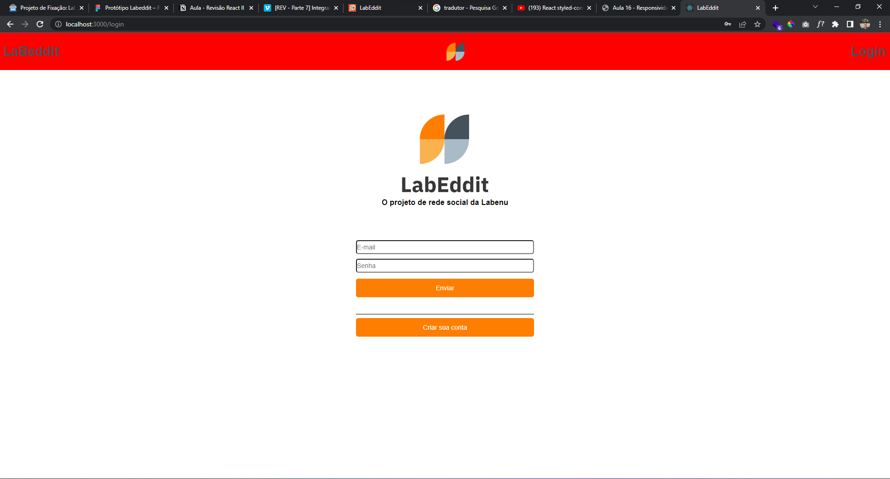
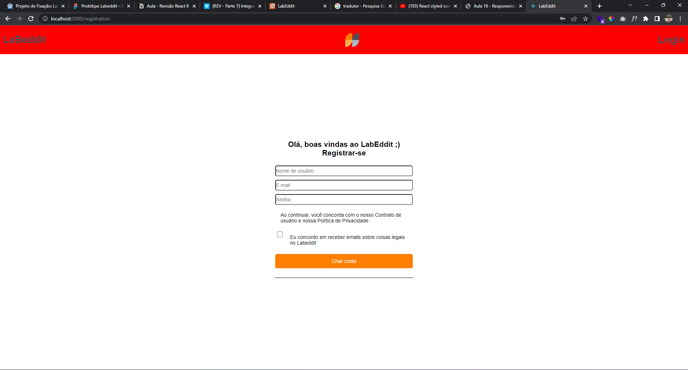
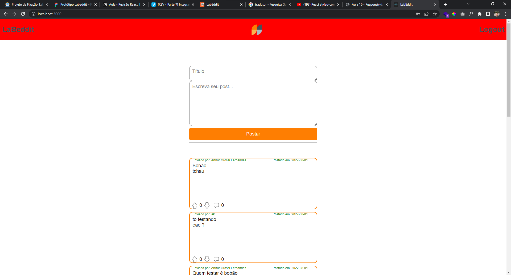
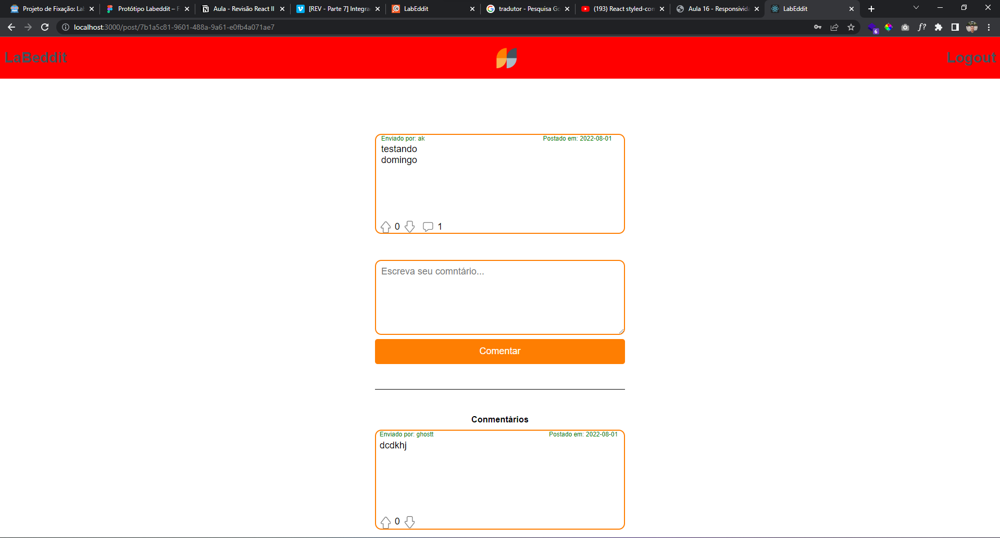

# `Projeto`
Projeto LabEddit

# `Link surge`
https://perfect-coil.surge.sh/

# `Descrição`
O Projeto LabEddit, foi desenvolvido com objetivo de permitir o usuário postar uma opnião e outros pessoas responderem seu ponto de vista, pode ser usado como local de debate dos mais variados assuntos, ou também para aqueles que quiserem discutir sobre suas tópicos preferidos e só criar sua conta e se divertir com suas amigos.

*a API pode ser encontrada [aqui](https://documenter.getpostman.com/view/9731983/U16eu7nT)
 
O repositório do projeto pode ser encontrado [aqui](https://github.com/future4code/alves-Olavo-Nascimento/pull/36)

# `Modo de usar`
Ao entrar só site o usuário será redirecionado para a pagina de login, onde ele pode acessar com seu email e senhas cadastrados, caso ainda não seja cadastrado, apenas clicar no botão "Criar sua conta" que será redirecionado para uma página onde poderá se registrar, após o cadastro será redirecionado para a pagina de login, inserindo seus dados entrará no site na pagina de feed.
 
Aqui será mostrado uma lista de posts onde e possível dar
like ou deslike nos posts. Caso seja clicado uma vez no like indicado com seta para cima seu like será registado e o botão ficará preenchido com a cor preta caso aperte novamente ele será removido seu like e o botão voltará a ficar com sua aparência inicial, o mesmo acontece com o botão de seta para baixo. Também e possível ver quantas interações de likes indicados por um número entre os botões de like e deslike, e um ícone de balão de conversa ao lado dos botões citados mostra a quantidade de comentários existente na quele post.
 
Acima do meio da página existe um dois campos onde podem ser criado um post, com um título e o corpo em si do post, clicando no botão postar.
 
Clicando sobre a área do post, será redirecionado para a página de lista de comentários do post clicado. Nela e possível ver o post clicado na parte superior da página mais abaixo existe um campo para fazer comentários no post e abaixo desse campo citado uma lista com os comentários já feitos.
 
No topo da página existe um header com dois botões um com o nome do projeto que caso clicado leva para a pagina de lista de posts e outro com nome de logout  que clicando o usuário será dislogado e redirecionado para a página de login.
 

# `O que não funciona`
Na página de registrar-se depois de inseridos os dados necessários, não sei porque mas ele e redirecionado para o login novamente, mesmo eu tendo colocado no sucesso da requisição para ele ir para a pagina de posts.
 
Após ser feito o login pela primeira vez, na página de lista de posts da um erro, que isso só aconteceu depois que mudei todas as requisições para uma só pasta e não tive tempo para conserta, mas e só atualizar a pagina que tudo funciona como deveria.

# `Instalando e rodando o projeto`
Fazer o clone do projeto:
- git clone link-do-repositório

Instalar as dependências:
- npm install

Rodar o projeto:
- npm run start

# `Tecnologias utilizadas`

# `Autor`
Olavo Marques do Nascimento

# `Imagens`
### Página login

### Página registra-se

### Página lista de postes

### Página comentários do post
